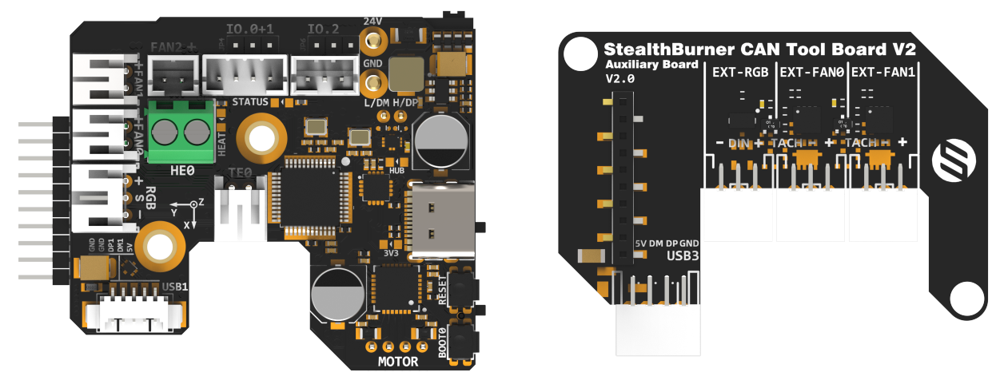
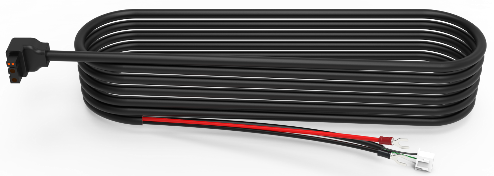

## Introduction:
 SB CAN V2 is a newly designed SB tool board running Klipper firmware. Based on STM32F072, it provides two communication modes: CANBUS and USB. The onboard USBHUB has up to three USB interfaces, which can be used to connect to the scanning leveling sensor (Scanner Leveling Sensor,such as IDM or Cartographer )and AI camera, etc. It can also be connected vertically with an optional board for easy use.

## Features:

- STM32F072 MCU, supports Klipper Firmware

- **6-layer PCB design, all solid capacitors and tantalum capacitors**

- Onboard 2 M3 3.5mm isolation columns, no need for printed parts, easy to install

- Onboard CAN/USB switch

- Onboard RESET and BOOT0 buttons for easy firmware update

- Fan control/heating both use independent high-power MOS, safer and lower heat

- **Onboard 5V@3A DC-DC, 5V peak load can reach 15W**

- XT30 interface, customized connection cable comes with the board

- **Onboard USB2.0 HUB, 3x USB2.0 interface (one of which is located on the auxiliary board)**

- **Support CAN / USB2.0 connection**

- Supports auxiliary board connection For front cover quick install & remove Support 

- Auxiliary board connection for quick installation and removal of the front cover. You can add 1x USB, 2x 3-wire fans, 1x RGB by the auxiliary board

- Onboard TMC2209

- 3x Fans, 3x IO with level converter, 1x RGB,1x Heat, 1x thermistor,1x status LED 

- ADXL345 Accelerometer onboard 

- USB-C onboard for Firmware update

## Documents:

https://wiki.fysetc.com/SB_Combo_V2/
